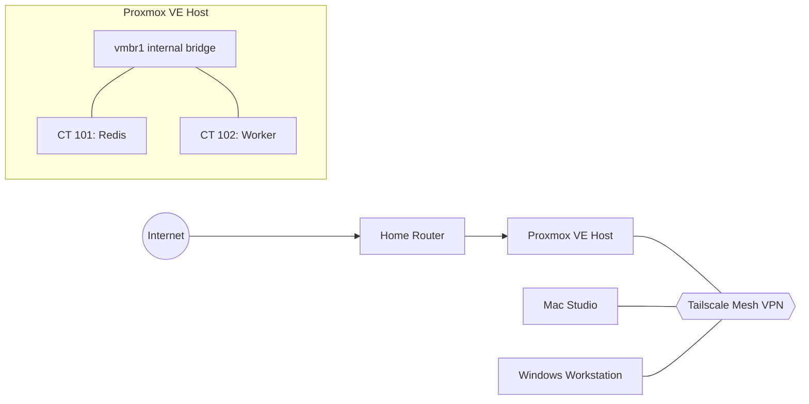

# Homelab

Documentation of my personal homelab — the environment I use daily to practice networking, virtualization, and Linux administration outside of coursework.

Everything here runs on hardware I own and manage myself. I use it as a sandbox for trying ideas from class, hosting side projects, and generally getting more comfortable with the kinds of systems I'd work on in an IT role.

> Internal IP addresses in this repo have been replaced with placeholders (e.g. `10.0.0.x`) for privacy.

---

## Hardware

| Role | Machine | Notes |
|---|---|---|
| **Virtualization host** | Custom-built server | Runs Proxmox VE, hosts all Linux containers |
| **Primary workstation** | Mac Studio (M1 Ultra, 64 GB RAM) | Development machine |
| **Secondary workstation** | Lenovo Legion (Windows) | GPU workstation for heavier workloads |

---

## Network Overview

- **Home router** handles the public-facing side (NAT, DHCP for the LAN)
- **Proxmox host** sits on the LAN and hosts all containers on an internal virtual bridge (`vmbr1`) so container-to-container traffic never leaves the host
- **Tailscale** provides a mesh VPN that links the Proxmox host, Mac Studio, and Windows workstation so I can reach services from any of my machines without exposing ports to the internet

---

## Virtualization (Proxmox VE)

Proxmox VE is the hypervisor. I use LXC containers (not full VMs) for most workloads because they start fast, use less memory, and are easy to snapshot.

Current containers:

| ID | Purpose | OS | Notes |
|---|---|---|---|
| CT 101 | Redis | Debian | In-memory data store used by jobs and caching |
| CT 102 | Worker node | Debian | Runs Node.js background jobs under pm2 |

Each container:

- Is on the internal `vmbr1` bridge with a static IP in `10.0.0.0/24`
- Has its own user account for running services (no running as root)
- Is snapshotted before any major change so I can roll back

---

## Self-Hosted Services

- **Redis** — job queue and cache
- **PostgreSQL** — primary database for personal projects
- **Node.js services** — run under `pm2` for auto-restart and log management
- **SSH** — key-based authentication only; password login disabled

---

## Remote Access

All remote access goes through **Tailscale** rather than exposed ports on my home router. Benefits:

- No inbound ports open on the public internet
- Every device authenticates through Tailscale's identity provider
- Access is per-device, so a compromised machine can be removed from the network immediately

---

## What I've Learned Running This

- **Linux fundamentals** — package management, users and permissions, systemd services, SSH configuration, log inspection
- **Networking** — bridges, static IPs, subnetting, routing between the LAN and the container network
- **Virtualization** — difference between LXC containers and full VMs, resource allocation, snapshots
- **Secure remote access** — why Tailscale / WireGuard is a better default than port forwarding + SSH
- **Service management** — keeping long-running processes alive with `pm2` and `systemd`, reading logs when something breaks

---

## Why I Built This

Class covers the theory well, but I learn best by actually breaking things and fixing them. Having my own hardware to run Proxmox on has been the single most useful thing I've done alongside my coursework — almost every concept from my networking and IT fundamentals classes maps directly to something I've configured here.
